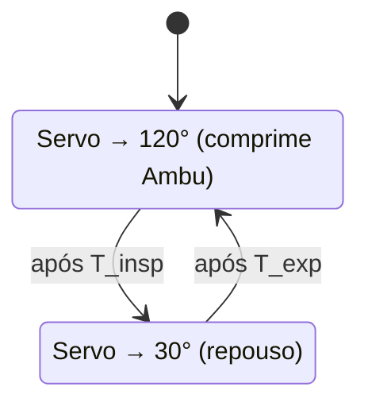

# Relatório Técnico — Ambu Automatizado

**Projeto acadêmico de automação de reanimador manual tipo Ambu (BVM)**  
**Disciplina / Curso:** Engenharia Biomédica / Eletrônica / Sistemas Embarcados  
**Data:** 2025  

---

> **AVISO IMPORTANTE:** Este documento descreve um **protótipo educacional** desenvolvido exclusivamente para fins de aprendizado, demonstração em laboratório e prototipagem acadêmica. **Não constitui dispositivo médico, não possui certificação regulatória (ANVISA, FDA, CE) e não deve ser utilizado em pacientes reais ou substituir ventiladores hospitalares certificados.**

---

## Sumário

1. [Etapa 1 — Pesquisa de sistemas existentes](#etapa-1--pesquisa-de-sistemas-existentes)
2. [Etapa 2 — Projeto eletrônico](#etapa-2--projeto-eletrônico)
3. [Etapa 3 — Firmware do Arduino](#etapa-3--firmware-do-arduino)
4. [Etapa 4 — Modelagem da lógica de controle](#etapa-4--modelagem-da-lógica-de-controle)
5. [Etapa 5 — Simulação](#etapa-5--simulação)
6. [Etapa 6 — Sistema mecânico](#etapa-6--sistema-mecânico)
7. [Etapa 7 — Impressão 3D](#etapa-7--impressão-3d)
8. [Etapa 8 — Testes de funcionamento](#etapa-8--testes-de-funcionamento)
9. [Etapa 9 — Roteiro do vídeo](#etapa-9--roteiro-do-vídeo)
10. [Entregáveis finais](#entregáveis-finais)

---

## Etapa 1 — Pesquisa de sistemas existentes

### 1.1 Open BVM Ventilator (whpthomas)

| Item | Descrição |
|------|-----------|
| **Nome** | Open BVM Ventilator |
| **Finalidade** | Plataforma open-source de referência para ventilação não invasiva com BVM; testes e validação em bancada |
| **Princípio** | Motor stepper NEMA 17 aciona mecanismo de compressão; Arduino Uno com arquitetura MVC; sensores BME280 |
| **Vantagens** | 25 peças 3D documentadas; BOM completo; firmware com aceleração linear; shield PCB disponível |
| **Limitações** | Fluxo máximo ~35 L/min; stepper ruidoso; complexidade elevada para projeto introdutório |
| **Motor** | NEMA 17 + driver A4988/TB6560 |
| **Mecanismo** | Braço/fuso convertendo rotação em compressão linear |
| **Repositório** | https://github.com/whpthomas/open_bvm_ventilator |
| **STLs** | Pasta `3d/` + Thingiverse thing:4335859 |
| **Imagens** | README do GitHub; Thingiverse |

---

### 1.2 Automatic Resuscitator — Ambu (joelfrax)

| Item | Descrição |
|------|-----------|
| **Nome** | Automatic Resuscitator - Ambu |
| **Finalidade** | Reanimador automático 100% imprimível em < 12 h para contexto COVID-19 |
| **Princípio** | NEMA 17 + fuso (spindle); endstop para verificação de posição |
| **Vantagens** | Simples; arquivos SolidWorks/STEP para adaptação; testado a 15–16 rpm |
| **Limitações** | Sem interface clínica avançada; projeto em fase de testes |
| **Motor** | NEMA 17 |
| **Mecanismo** | Fuso/ball screw |
| **Repositório** | https://www.thingiverse.com/thing:4239988 |
| **STLs** | lat1, lat2, Nema, sop_bisagra, sop_respirador, FV2-hinge, Endstop support |
| **Imagens** | Galeria Thingiverse |

---

### 1.3 SimFeedback DIY RC Servo Ventilator

| Item | Descrição |
|------|-----------|
| **Nome** | DIY 3DP Ventilator — RC Servo |
| **Finalidade** | Ventilador DIY com servos RC para Ambu SPUR II / MARK IV |
| **Princípio** | Dois servos RC comprimem o balão simetricamente |
| **Vantagens** | **Usa servos** (similar ao nosso escopo); STLs dedicados; domínio público |
| **Limitações** | WIP; sem interface; requer alteração de código para parâmetros |
| **Motor** | 2× servos RC alto torque (ex. Turnigy S8166M 33 kg) |
| **Mecanismo** | Braços opostos |
| **Repositório** | https://github.com/SimFeedback/DIY-3DP-Ventilator---RC-Servo- |
| **STLs** | Pasta `/STL` |
| **Imagens** | Vídeos YouTube no README |

---

### 1.4 LRVent (makefastworkshop)

| Item | Descrição |
|------|-----------|
| **Nome** | LRVent |
| **Finalidade** | Ventilador BVM de último recurso com peças locais e impressão PLA |
| **Princípio** | Estrutura modular parametrizável; motor variável |
| **Vantagens** | CC0 (domínio público); ferramentas mínimas; PLA suficiente |
| **Limitações** | Mecânica depende de peças disponíveis localmente |
| **Motor** | NEMA, BLDC ou similar |
| **Mecanismo** | Alavanca / correia configurável |
| **Repositório** | https://github.com/makefastworkshop/LRVent |
| **STLs** | Exportados do CAD no repositório |

---

### 1.5 RepRapable BVM Ventilator (Michigan Tech / Pearce)

| Item | Descrição |
|------|-----------|
| **Nome** | RepRapable Automated Open Source BVM Ventilator |
| **Finalidade** | Ventilador de emergência <$170; FR 5–40 rpm; VT 100–800 mL |
| **Princípio** | Arduino + RTOS; estrutura paramétrica FreeCAD/OpenSCAD |
| **Vantagens** | Publicação acadêmica peer-reviewed; design paramétrico; SPI para sensores |
| **Limitações** | Complexidade de firmware RTOS; requer impressora ≥ 230×230 mm |
| **Motor** | Stepper |
| **Mecanismo** | Estrutura RepRap com caixas de junção 3D |
| **Repositório** | https://osf.io/fjdwz |
| **STLs** | Pressure_sensor_junction_box.stl, breathing_system, control_box |

---

### 1.6 MIT Emergency Ventilator (E-Vent)

| Item | Descrição |
|------|-----------|
| **Nome** | MIT Emergency Ventilator |
| **Finalidade** | Referência de design de emergência; braços acrílicos motorizados comprimem Ambu |
| **Princípio** | Dois braços motorizados sincronizados; evolução Uno → Mega + RoboClaw |
| **Vantagens** | Documentação clínica extensa; testes em modelos animais |
| **Limitações** | Código restrito em versões iniciais; não certificado; mecânica não trivial |
| **Motor** | DC com RoboClaw / inicialmente Uno |
| **Mecanismo** | Dois braços acrílico fechando em sincronia |
| **Repositório** | https://emergency-vent.mit.edu/ |
| **STLs** | Referência hardware; derivados em GitHub (IST-Emergency-Ventilator) |

---

### 1.7 ApolloBVM (Rice University)

| Item | Descrição |
|------|-----------|
| **Nome** | ApolloBVM |
| **Finalidade** | HALO ventilator; rack-and-pinion; PEEP; <$250 |
| **Princípio** | Dual rack-and-pinion; 2× Arduino (master/slave); servos goBILDA |
| **Vantagens** | Testado 24 h; documentação clínica; GitHub ativo |
| **Limitações** | Complexidade eletrônica e mecânica alta |
| **Motor** | 2× servos goBILDA Dual Mode |
| **Mecanismo** | Rack-and-pinion |
| **Repositório** | https://github.com/apollobvm/apollobvm |

---

### 1.8 Comparativo resumido

| Projeto | Servo/Stepper | STL | Arduino | Adequação acadêmica |
|---------|---------------|-----|---------|---------------------|
| SimFeedback RC | **Servo** | Sim | Sim | **Alta** (escopo similar) |
| Sukh Ka Saans | **Servo** | Não | Sim | Alta |
| Noora Ventilator | **2× Servo** | Não | Uno | Alta |
| joelfrax | Stepper | Sim | Não incluído | Média |
| Open BVM | Stepper | Sim | Uno | Média (complexo) |
| LRVent | Variável | Sim | Opcional | Média |
| MIT E-Vent | DC | Parcial | Mega | Baixa (complexo) |
| ApolloBVM | Servo | Sim | 2× Uno | Baixa (complexo) |

**Conclusão da pesquisa:** Para o escopo deste trabalho (Arduino Uno + 1 servo + potenciômetro + LCD), os projetos **SimFeedback**, **Sukh Ka Saans** e **Noora-Alhajeri** são as referências eletrônicas mais próximas; **joelfrax** e **SimFeedback** fornecem STLs mecânicos adaptáveis.

---

## Etapa 2 — Projeto eletrônico

### Componentes

| Qtd | Componente |
|-----|------------|
| 1 | Arduino Uno R3 |
| 1 | Servo alto torque (≥ 20 kg·cm) |
| 1 | Potenciômetro 10 kΩ linear |
| 1 | LCD 16×2 + módulo I2C (PCF8574) |
| 1 | Fonte 5–6 V, ≥ 3 A (servo) |
| 1 | Cabo USB / fonte 5 V (Arduino) |

### Ligações detalhadas

Ver documento completo: [`schematic/ESQUEMA_CIRCUITO.md`](../schematic/ESQUEMA_CIRCUITO.md)

#### Potenciômetro
- Terminal 1 → **5 V**
- Terminal 2 (cursor) → **A0**
- Terminal 3 → **GND**

#### Display I2C
- **VCC** → 5 V | **GND** → GND | **SDA** → A4 | **SCL** → A5

#### Servo
- **Sinal** → D9 | **VCC** → fonte externa 5–6 V | **GND** → GND comum

**Regra crítica:** GND da fonte do servo conectado ao GND do Arduino.

---

## Etapa 3 — Firmware do Arduino

### Arquivo
`firmware/ambu_automatico.ino`

### Funções implementadas

| # | Requisito | Implementação |
|---|-----------|---------------|
| 1 | Ler potenciômetro | `lerFrequenciaRespiratoria()` — média de 5 amostras em A0 |
| 2 | Converter para FR | `map(0–1023 → 8–30 rpm)` |
| 3 | Limitar faixa 8–30 | `constrain(fr, FR_MIN, FR_MAX)` |
| 4 | Display | `atualizarDisplay()` — linhas fixas conforme especificação |
| 5 | Controlar servo | `executarCicloRespiratorio()` — máquina de estados |
| 6 | Simular compressão | Ângulos 30° (repouso) ↔ 120° (compressão) |

### Estrutura do código
- `setup()` — init serial, LCD, servo
- `loop()` — leitura contínua + ciclo respiratório
- Auxiliares: `calcularTemposCiclo()`, `moverServoSuave()`

### Matemática: RPM → tempo entre ciclos

A frequência respiratória **FR** (em respirações por minuto, rpm) define o **período do ciclo**:

\[
T_{ciclo} \ [s] = \frac{60}{FR}
\]

| FR (rpm) | \(T_{ciclo}\) |
|----------|---------------|
| 8 | 7,5 s |
| 10 | 6,0 s |
| 15 | 4,0 s |
| 20 | 3,0 s |
| 30 | 2,0 s |

**Implementação em código:**
```cpp
unsigned long periodoCicloMs = 60000UL / fr;
```

Com relação **I:E = 1:2**:
\[
T_{insp} = T_{ciclo} \times \frac{1}{3}, \quad T_{exp} = T_{ciclo} \times \frac{2}{3}
\]

---

## Etapa 4 — Modelagem da lógica de controle

### Faixa de operação

| FR | Intervalo/ciclo | T_insp (1:2) | T_exp (1:2) |
|----|-----------------|--------------|-------------|
| 8 rpm | 7,5 s | 2,5 s | 5,0 s |
| 10 rpm | 6,0 s | 2,0 s | 4,0 s |
| 15 rpm | 4,0 s | 1,33 s | 2,67 s |
| 20 rpm | 3,0 s | 1,0 s | 2,0 s |
| 30 rpm | 2,0 s | 0,67 s | 1,33 s |

### Tempo de inspiração
Fase em que o servo avança para **ANGULO_COMPRESSAO (120°)**, reduzindo volume do balão Ambu e expulsando ar pelo valvulamento do BVM.

### Tempo de expiração
Fase em que o servo retorna a **ANGULO_REPOSO (30°)**; elasticidade do balão promove reexpansão (simulação simplificada — sem paciente conectado).

### Relação I:E simplificada
**I:E = 1:2** — para cada 1 parte de inspiração, 2 partes de expiração. Padrão didático comum em ventilação manual automatizada simplificada.

### Comportamento do servo



---

## Etapa 5 — Simulação

### Tinkercad
Instruções: [`docs/SIMULACAO_TINKERCAD.md`](SIMULACAO_TINKERCAD.md)

### Wokwi
- `wokwi/diagram.json` — diagrama de fiação
- `wokwi/sketch.ino` — firmware
- Instruções: [`docs/SIMULACAO_WOKWI.md`](SIMULACAO_WOKWI.md)

---

## Etapa 6 — Sistema mecânico

### Opções de acionamento

| Mecanismo | Descrição | Aplicação neste projeto |
|-----------|-----------|-------------------------|
| **Braço articulado** | Servo → braço rígido → platô | **Recomendado** — simples, 1 servo |
| **Came excêntrica** | Rotação contínua converte em movimento alternado | Maior desgaste; requer rolamento |
| **Alavanca** | Amplifica força, reduz curso | Útil se servo subdimensionado |
| **Rack-and-pinion** | Linear preciso | ApolloBVM; requer 2 motores |

### Diagrama do braço articulado (proposto)

```
        ┌─── Eixo servo
        │
   [Servo]───[Braço 80mm]───● Platô compressor
                              │
                         [Ambu BVM]
                              │
                         [Base fixa]
```

### Amplitude do movimento
- **Angular:** 90° úteis (30° → 120°)
- **Linear na ponta (braço 80 mm):** ≈ 70 mm de curso
- Calibrar conforme volume desejado no manequim de treino

### Retorno à posição inicial
- **Expiração:** comando explícito `servoAmbu.write(ANGULO_REPOSO)`
- **Mola auxiliar (opcional):** auxilia retorno se histerese mecânica

### Força necessária
- Compressão BVM adulto: tipicamente **15–40 N** (treino/maniquim)
- Servo ≥ 20 kg·cm a 10 cm de braço ≈ 19,6 N — **margem mínima**
- Recomendado: **≥ 40 kg·cm** (DS3218, MG996R reforçado, ou equivalente)

### Vantagens do servo de alto torque
- Posicionamento angular definido (volume reprodutível)
- Integração direta com Arduino (`Servo.h`)
- Custo baixo vs. stepper + driver + fuso
- Adequado para protótipo acadêmico de baixa complexidade

---

## Etapa 7 — Impressão 3D

Ver lista completa: [`docs/PECAS_3D.md`](PECAS_3D.md)

### Parâmetros

| Parâmetro | Valor |
|-----------|-------|
| Material | PLA |
| Altura de camada | 0,2 mm |
| Preenchimento | 30% |
| Temperatura bico | 200 °C |
| Mesa | 60 °C |

---

## Etapa 8 — Testes de funcionamento

Ver protocolo: [`docs/TESTES.md`](TESTES.md)

| Teste | Resultado esperado |
|-------|-------------------|
| 1 — Potenciômetro | FR ∈ [8, 30] rpm |
| 2 — Display | `AMBU AUTOMATICO` / `FR = XX rpm` |
| 3 — Servo | Oscila 30° ↔ 120° |
| 4 — Sincronização | T_ciclo = 60/FR ± 10% |

---

## Etapa 9 — Roteiro do vídeo

Ver roteiro completo: [`docs/ROTEIRO_VIDEO.md`](ROTEIRO_VIDEO.md)

---

## Entregáveis finais

| # | Entregável | Localização |
|---|------------|-------------|
| 1 | Código Arduino | `firmware/ambu_automatico.ino` |
| 2 | Esquemático | `schematic/ESQUEMA_CIRCUITO.md` |
| 3 | Simulação Wokwi | `wokwi/diagram.json`, `wokwi/sketch.ino` |
| 4 | Lista de materiais | `docs/BOM.md` |
| 5 | STLs (referências) | `docs/PECAS_3D.md` + links repositórios |
| 6 | Mecanismo | Seção 6 deste relatório |
| 7 | Relatório técnico | Este documento |
| 8 | Roteiro vídeo | `docs/ROTEIRO_VIDEO.md` |
| 9 | Referências | `referencias/REFERENCIAS.md` |

---

## Conclusão

O projeto Ambu Automatizado demonstra a integração entre sensores analógicos, atuadores e interfaces em um contexto de engenharia biomédica educacional. A conversão matemática FR → tempos de ciclo, a máquina de estados inspiratória/expiratória e o acionamento por servo constituem base sólida para trabalhos futuros (sensores de pressão, alarmes, volume tidal controlado). **Reitera-se: trata-se exclusivamente de protótipo acadêmico, sem aplicação clínica.**

---

*Documento gerado como parte do projeto acadêmico Ambu Automatizado.*
