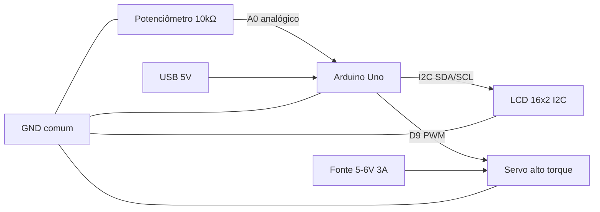

# Esquemático do Circuito — Ambu Automatizado

> Protótipo acadêmico — não certificado para uso clínico.

## Diagrama de blocos



## Esquema elétrico detalhado

```
                    ┌─────────────────────────────────────────┐
                    │            ARDUINO UNO                    │
                    │                                         │
   Potenciômetro    │  5V ────────────────────────────────┐   │
   10 kΩ             │  GND ───────────────────────────┐ │   │
                     │  A0 ◄───────────────────────┐   │ │   │
                     │  A4 (SDA) ◄─────────────┐   │   │ │   │
                     │  A5 (SCL) ◄───────────┐ │   │   │ │   │
                     │  D9 (PWM) ──────────┐ │ │   │   │ │   │
                     │  GND ─────────────┐ │ │ │   │   │ │   │
                     └─────────────────┼─┼─┼─┼─┼───┼─┼─┼─┼───┘
                                       │ │ │ │ │   │ │ │ │
         Terminal 1 ─── 5V ────────────┘ │ │ │ │   │ │ │ │
         Terminal 2 ─── A0 (cursor) ─────┘ │ │ │   │ │ │ │
         Terminal 3 ─── GND ─────────────────┘ │ │   │ │ │ │
                                               │ │   │ │ │ │
         LCD I2C 16x2:                         │ │   │ │ │ │
           VCC ─── 5V ─────────────────────────┘ │   │ │ │ │
           GND ─── GND ────────────────────────────┘   │ │ │ │
           SDA ─── A4 ───────────────────────────────────┘ │ │ │
           SCL ─── A5 ─────────────────────────────────────┘ │ │
                                                             │ │
         Servo motor:                                        │ │
           Sinal (laranja) ─── D9 ───────────────────────────┘ │
           VCC (vermelho)  ─── Fonte externa 5-6V (+)        │
           GND (marrom)    ─── GND comum ──────────────────────┘

         Fonte externa do servo:
           (+) ─── VCC do servo
           (−) ─── GND comum (OBRIGATÓRIO: GND da fonte = GND Arduino)
```

## Descrição detalhada das conexões

### 1. Potenciômetro (10 kΩ)

| Terminal | Conexão | Função |
|----------|---------|--------|
| Extremo 1 | 5 V (Arduino) | Tensão de referência máxima |
| Extremo 2 | GND (Arduino) | Referência zero |
| Cursor (central) | A0 | Tensão variável 0–5 V proporcional à rotação |

**Funcionamento:** Com o cursor no mínimo, A0 ≈ 0 V (FR = 8 rpm). No máximo, A0 ≈ 5 V (FR = 30 rpm). Valores intermediários mapeiam linearmente.

### 2. Display LCD 16×2 com I2C

| Pino módulo | Conexão Arduino | Função |
|-------------|-----------------|--------|
| VCC | 5 V | Alimentação |
| GND | GND | Referência |
| SDA | A4 | Dados I2C (Uno usa A4 como SDA) |
| SCL | A5 | Clock I2C (Uno usa A5 como SCL) |

**Nota:** Se o display não responder, teste o endereço I2C com scanner (0x27 ou 0x3F). Ajuste `ENDERECO_LCD` no firmware.

### 3. Servo motor

| Fio | Conexão | Função |
|-----|---------|--------|
| Sinal (laranja/amarelo) | D9 | Comando PWM de posição (0°–180°) |
| VCC (vermelho) | Fonte externa 5–6 V | Alimentação de potência |
| GND (marrom/preto) | GND comum | Referência compartilhada |

**Importante:**
- O pino D9 gera sinal PWM de 50 Hz (padrão biblioteca Servo).
- A corrente de pico do servo (até 2–3 A) excede a capacidade do regulador do Arduino (~500 mA).
- Conectar GND da fonte externa ao GND do Arduino é **obrigatório** para referência comum do sinal.

### 4. Alimentação

| Fonte | Alimenta | Especificação |
|-------|----------|---------------|
| USB ou adaptador 5 V | Arduino Uno | ≥ 500 mA |
| Fonte dedicada 5–6 V | Servo motor | ≥ 3 A recomendado |

## Tabela resumo de pinos

| Pino Arduino | Direção | Componente | Descrição |
|--------------|---------|------------|-----------|
| 5 V | Saída | Pot, LCD | Alimentação 5 V |
| GND | — | Todos | Terra comum |
| A0 | Entrada | Potenciômetro | Leitura analógica FR |
| A4 | I/O | LCD SDA | Barramento I2C |
| A5 | I/O | LCD SCL | Barramento I2C |
| D9 | Saída PWM | Servo | Controle de posição |

## Proteções recomendadas (opcional em protótipo)

- Capacitor eletrolítico 470–1000 µF na alimentação do servo (próximo aos terminais).
- Capacitor cerâmico 100 nF entre 5 V e GND do LCD.
- Diodo flyback se usar relé ou carga indutiva adicional.
